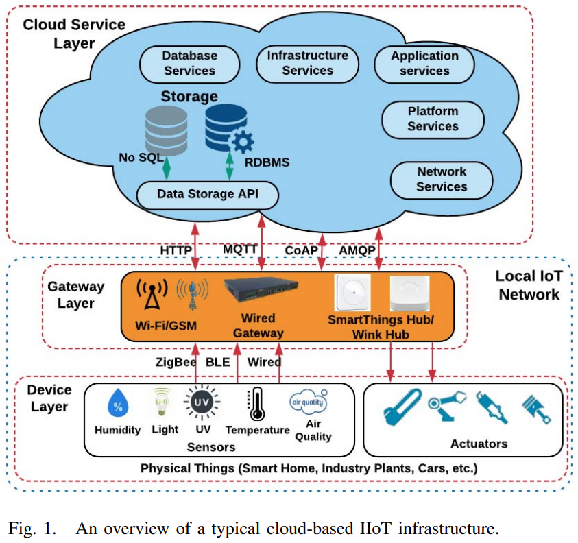
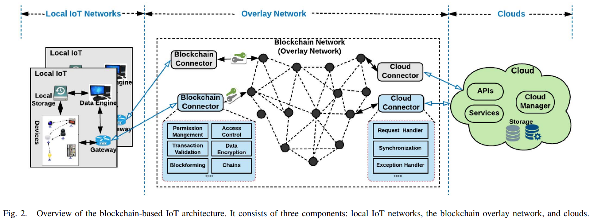
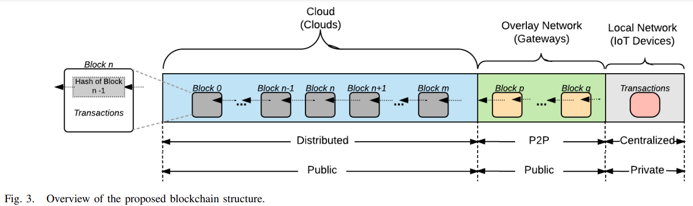

# Heirarchical Storage by : Gang Wang, Zhijie Jerry Shi, Mark Nixon, Song Han #

Here **"transaction"** word is used for the sensor/actuator information trasactions performed by the sensors/actuators.

The conventional IIoT architecture has a centralized processing component, i.e. mostly a cloud service stack. The data stored in such a stack is majorly transfered in a centralized manner. 

There may exist a transmission gateway as well as a communication gateway to be assiged to a particular low powered IoT edge device. This obvious communication gateway can be a centralized point of attack/failure. And conventional centralized approach does not give us the capability of validating the sources. The invalid sources of data can generate fake transactions to produce DoS attacks while exhausting the centralized storage capacity.

One possible solution to implement this is storing the data in a heirarchical fashion using a blockchain. Keeping the transactional data immutable. 

For implementing this particular architecture, the current state of the art research suggests the implementation of an Overlay Layer which connects the ends of local IoT and the cloud end with the more decentralized P2P network. 

In the Blockchain Connectors, the Permission management, Access Control, Transaction Validation make sure that the sources are well validated in order to implement the conventional third party blockchains for distributed ledger system, keeping the trust of the system intact.  
The data encryption, blockforming and chaining mechanisms are the standard building blocks of the distributed ledger system.

The cloud connector plays an important role of making the data usable for storage purposes. The Bitcoin P2P distributed ledger is capable of creating 52GB of data over the network every year (average volume: 1.67KB per second with block size limited to 1MB), but when implemented for the simplest medium sized Industrial Automation System is capable of creating 302.4GB of data every year under the same limitations of the block size (block size 1MB, but the average volume : 500KB per second).

Hence the consensus protocols have to be managed in order to handle the high volume of data. 

After this handling, the Request Handler and Synchronizazion blocks in the coud connectors form a body of persistant knowledge again in the form of blockchains to be stored onto the cloud storage networks.

Data handling on the cloud architectures is always handled in a distributed fashion. 

- Removes the single point failure for communications aspect
- Adds more immutable data structures for the distributed transactional ledger
